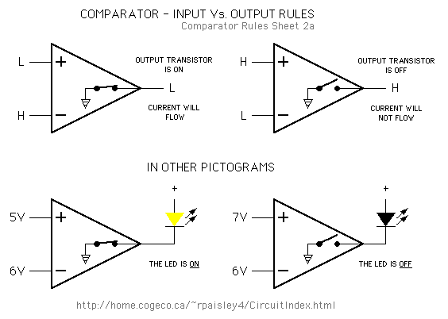
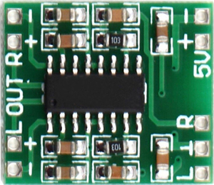

**Project name:** ZeroPie Handheld Game Console

**Purpose:** When you feel like playing some old retro games but you don’t really want to sit in front of a computer to do it and there’s no handheld console available that is able to play more than 50 systems including NES, SNES, GBA, Sega Master System, Sega Genesis, Atari systems, DOS games, old PC games and many more, you build one of this and you have everything in one nice little mobile device.

**Costs: aprox 45USD.**

# Hardware Requirements:

- Raspberry Pi Zero
- MicroSD card (8Gb or more)
- Li-Ion battery (I used a LG battery from a smartphone, around 2000mAh)
- TP4050 Charging Module with protection
- DC-DC Step-Up converter
- Pam8403 Audio amplifier module
- Mini Speaker
- MCP23017 I2C Port Expander
- Perfboard
- 1.44” ili9163 SPI LCD Module
- 14 Push Buttons
- 1 Toggle Switch
- Li-Ion Battery Level Module:
    ◦ Resistors:
       ▪ 1 x 5k
       ▪ 4 x 1k
       ▪ 1 x 17k (it can be made of multiple ones)
       ▪ 2 x 10k
       ▪ 4 x 330R
    ◦ 4 x LED (2 yellow, 2 green or 1 red, 1 yellow and 2 green...)
    ◦ 1 x LM
    ◦ 1 x TL
- RC Audio Filter:
    ◦ Resistors:
       ▪ 2 x 270R
       ▪ 2 x 150R
    ◦ Capacitors:
       ▪ 6 x 100nF
       ▪ 2 x 10uF
- Plastic Box (71.5mm X 124mm X 38mm)


# Software used:

- **Retropie** - https://retropie.org.uk/
- **mk_arcade_joystick_rpi** - https://github.com/recalbox/mk_arcade_joystick_rpi
- **fbtft** - https://github.com/notro/fbtft
- **rpi-fbcp** - https://github.com/tasanakorn/rpi-fbcp

# Building process

## The controller:
It is made using the MCP23017 port extender, 12 push buttons, perfboard or a printed circuit board, and wire, I used wire from a flexible cat5 Ethernet cable. I did it in modules, a piece of perfboard for the D-pad, a piece for A, B, X, Y buttons, a piece for select and start and one piece for each of the shoulder buttons. The wiring diagram is attached below:


This is how the mk_arcade_joystick_rpi driver expects the buttons to be wired. For a button to be read as being pressed it needs to be tied to ground.


- 3.3v is connected to pin1 on RPI.
- GND is connect to pin9.
- SDL is connected to pin5.
- SDA is connected to pin3.


The mk_arcade_joystick_rpi driver is installed with the following commands:

- `sudo apt-get update`
- `sudo apt-get install bc` (needed when working with kernel related stuff)
- `mkdir mkjoystick`
- `cd mkjoystick`
- `wget https://github.com/digitalLumberjack/mk_arcade_joystick_rpi/releases/download/v0.1.4/install.sh`
- `sudo sh ./install.sh updatesystem`
- `sudo reboot` (required)
- `sudo sh ./install.sh`
- Now activate i2c:
	- `sudo nano /etc/modules`
	- Now add the following lines in that file:
		◦ `i2c-bcm`
		◦ `i2c-dev`
- check in `/etc/modprobe.d/raspi-blacklist.conf` with the command `sudo nano /etc/modprobe.d/raspi-blacklist.conf` if there’s a line with `i2c-bcm2708`, if it is delete it and reboot.

Auto loading the driver with the right settings:
- `sudo nano /etc/modules` and add the line `mk_arcade_joystick_rpi`
- To load the driver with the required options create a file named `mk_arcade_joystick.conf` in `modprobe.d` folder (`sudo nano /etc/modprobe.d/mk_arcade_joystick.conf`) and add the following line: `options mk_arcade_joystick_rpi map=0x20` (0x20 is the address of the MCP23017 port expader set by its A0, A1 and A2 pins, connect them all to ground and you get the address 0x20)
After a reboot you can try it with `jstest /dev/input/js0`.

## Li-Ion Battery Level Module:


The principal components of this module is the LM339 quad comparator and a TL431 voltage reference. The printed circuit board of this module is shown here. 

How this module works : By tying the reference pin of the TL431 to its cathode and powering it through a 1k, resistor which is R6 in our circuit, we get a stable reference voltage of 2.5v. We take this voltage and pass it to a multiple resistor voltage divider that will set our 4 battery levels which will be 2v, 1.9v, 1.8v, 1.7 and connect
them to the non-inverting inputs (+) of the 4 comparators. The battery voltage will be halved by the resistor divider formed by R8 and R7 and it will be connected to the inverting input (-) of each comparator.


If the battery voltage is higher than the reference then the output of the comparator will be tied to ground and in consequence the led tied to that specific comparator will light up. Lets take for example the first comparator. It’s reference voltage is 2v, the battery voltage is 4.15V, halved in half it’s 2.075 so the led will light up.

This module is connected to the battery with a push button in series so it will not stay always on.



Inverting input higher that non-inverting results in led on.

## RC Audio Filter:


This is an RC low-pass filter, it is used to filter out the high frequencies of the PWM output. R3 and R4 are voltage dividers to get the 3.3v PWM signal down to around 1.1v which is suitable for audio use. C1..C3/C4..C6 together with R1/R2 is the low-pass filter. The cut-off frequency is around 17KHz. C7 and C8 are DC-filter capacitors that will only let AC to pass filter out any DC voltage that will blow your speakers.
More info and schematic: https://learn.adafruit.com/adding-basic-audio-ouput-to-raspberry-pi-zero

This module is connected to the Rpi as follows: ground to pin34, left/right channels to pin32 respectively pin33. It’s output will be connected to a PAM8403 amplifier. To get sound on those pins you need to add `dtoverlay=pwm2chan,pin=12,func=4,pin2=13,func2=4` to `/boot/config.txt` (`sudo nano /boot/config.txt`) and make sure that the line `dtparam=audio=on` is not commented out.

## PAM8403 amplifier:



It is a tiny and cheap class D audio amplifier module, it will take sound (weak signal, can’t drive a speaker) from the RC audio filter module and amplify it enough to drive a speaker from it’s output terminals. It’s power input is
connected as follows: ground to pin6 and 5v to pin2.

## The speaker:


Well, a tiny and cheap speaker, almost anything that will fit will do, we are not talking about quality sound when it comes to RPi PWM sound...

## The power source:


It’s made up from three parts:

- Battery, I used one from a defect LG smartphone with a capacity around 2Ah
- Charging module with under discharge protection
- DC-DC step-up boost converter
The battery is connected first to the TP4050 charging module and then it’s outputs are connected to the DC_DC boost converter, through a toggle switch, that will boost the battery voltage from 3.4v-4.2v to a stable 5v needed by the RPi. The boost converter is connected to the power input test pads of the RPi.

## The (tiny) screen:


It’s a 1.44” 128x128 SPI display based on the ili9163 driver.
It’s pins are connected as follows:

- LED - pin12
- SCK - pin23
- SDA - pin19
- A0 - pin18
- RESET - pin22
- CS - pin24
- GND - pin25
- VCC – pin17

To make the display work with Retropie we will use fbtft and rpi-fbcp:

- `sudo nano /etc/modules-load.d/fbtft.conf` and add 2 lines:
    ◦ `spi-bcm`
    ◦ `fbtft_device`
- `sudo nano /etc/modprobe.d/fbtft.conf` and add 1 line:
    ◦ `options fbtft_device name=nokia gpios=reset:25,dc:24,cs:8,led:18 rotate=90 verbose=0`
- Now for installing fbcp cd into your home dir and do:
    ◦ `git clone https://github.com/tasanakorn/rpi-fbcp.git`
    ◦ `cd rpi-fbcp`
    ◦ `mkdir build`
    ◦ `cd build`
    ◦ `cmake ..`
    ◦ `make`
    ◦ `sudo cp fbcp /usr/local/bin`
- `sudo nano /etc/rc.local` and add `/usr/local/bin/fbcp &` before `exit 0`
- `sudo nano /boot/config.txt` and uncomment the line `disable_overscan=1` just so you don’t have black borders and if you desire you can also add `consoleblank=0`.

After a reboot the screen should work. Fbcp is used to copy the contents of the first framebuffer to the second framebuffer which is our screen and it is set in `rc.local` to start at boot.

## Shutdown button:
If you want an easy way to shutdown your Pi connect a push button between pin37 and
pin39 and do:

- `sudo apt-get install python3-dev python3-pip`
- `pip install RPi.GPIO`
- `mkdir pythonScripts`
- `nano shutdown.py` and add the following script:
	```
	import RPi.GPIO as GPIO
	import os

	gpioPin=37
	GPIO.setmode(GPIO.BOARD)
	GPIO.setup(gpioPin, GPIO.IN, pull_up_down=GPIO.PUD_UP)

	try:
		GPIO.wait_for_edge(gpioPin, GPIO.FALLING)
		os.system("sudo shutdown -h now")
	except:
		pass

	GPIO.cleanup()
	```
- `sudo nano /etc/rc.local` and add `sudo python /home/pi/pythonScripts/shutdown.py &` before `exit 0`


_Entire Console Diagram_


